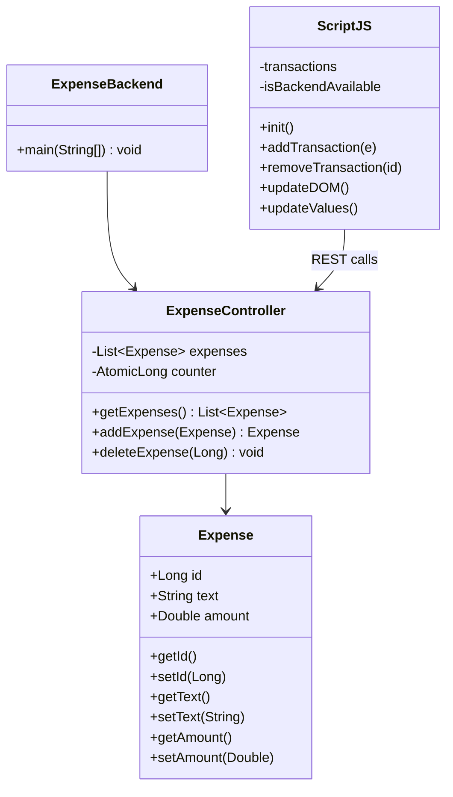
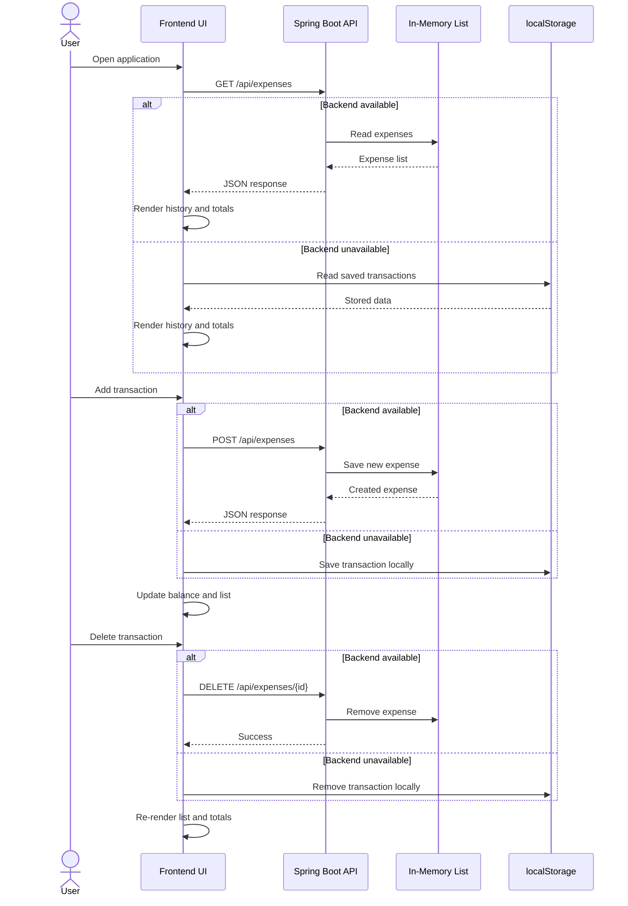
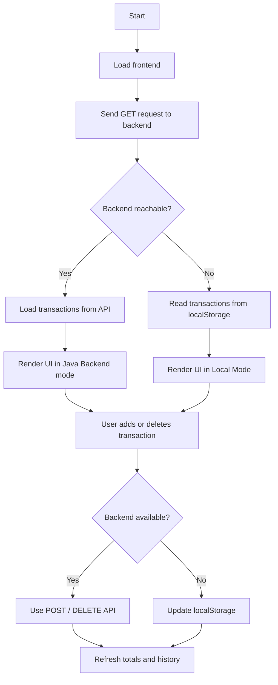

# Expense Tracker Lab Report

## 1. Project Title
**Expense Tracker Web Application**

## 2. Objective
The objective of this project is to design and implement a simple expense tracking system that allows users to add, view, and delete transactions. The project demonstrates the integration of a Java Spring Boot backend with a vanilla HTML, CSS, and JavaScript frontend.

## 3. Problem Statement
Many users need a lightweight application to record daily income and expenses, calculate balances, and manage transaction history. This project solves that problem by providing:

- a responsive web interface
- a REST API for transaction management
- a fallback local storage mode when the backend is unavailable

## 4. Technologies Used
- **Java**
- **Spring Boot**
- **Maven**
- **HTML**
- **CSS**
- **JavaScript**
- **Tailwind CSS**
- **Font Awesome**
- **Browser localStorage**

## 5. System Overview
The application is a full-stack expense tracker with two major parts:

- **Frontend**: A browser-based user interface built with HTML, CSS, JavaScript, Tailwind CSS, and Font Awesome.
- **Backend**: A Spring Boot REST API written in Java that stores expenses in memory.

When the backend is running, the frontend communicates with the API at `/api/expenses`. If the backend cannot be reached, the frontend switches to local storage so the application still works offline.

## 6. Functional Requirements
The system supports the following operations:

- display the current balance
- display total income
- display total expense
- add a new transaction
- delete an existing transaction
- load transaction data from backend or local storage

## 7. Non-Functional Requirements
- simple and responsive user interface
- quick data entry and deletion
- graceful fallback when backend is not available
- easy maintenance with small and clear code modules

## 8. System Architecture

```mermaid
flowchart LR
    U[User] --> B[Browser]
    B --> F[Frontend UI\nindex.html + style.css + script.js]
    F -->|GET /api/expenses| API[Spring Boot REST API]
    F -->|POST /api/expenses| API
    F -->|DELETE /api/expenses/{id}| API
    API --> MEM[(In-Memory Expense List)]
    F -->|Fallback| LS[(Browser localStorage)]
```

## 9. Component Diagram



## 10. Sequence Diagram



## 11. Fallback Flowchart



## 12. Module Breakdown

### 12.1 Frontend Module
The frontend is implemented using:

- `index.html` for the structure of the page
- `style.css` for custom visual styling
- `script.js` for application logic

The frontend is responsible for:

- loading transaction data
- rendering the transaction list
- calculating balance, income, and expense
- sending add/delete requests
- showing status messages and notifications

### 12.2 Backend Module
The backend consists of:

- `ExpenseBackend.java` as the application entry point
- `ExpenseController.java` as the REST controller
- `Expense.java` as the data model

The backend is responsible for:

- exposing REST endpoints
- storing expenses in memory
- assigning IDs to new transactions
- returning JSON data to the frontend

## 13. Backend API Description

### Base URL
`http://localhost:8080/api/expenses`

### Endpoints

#### GET `/api/expenses`
Returns the complete list of stored expenses.

#### POST `/api/expenses`
Adds a new expense or income record.

Request body example:
```json
{
  "text": "Salary",
  "amount": 50000
}
```

#### DELETE `/api/expenses/{id}`
Deletes a transaction by its ID.

## 14. Frontend Behavior
The JavaScript file performs the following tasks:

- tries to load expenses from the backend
- falls back to local storage if the backend is unavailable
- updates the balance and totals after every change
- creates list items for each transaction
- removes transactions using delete buttons
- shows toast notifications for status and errors

The application calculates:

- **Balance** = sum of all transaction amounts
- **Income** = sum of all positive amounts
- **Expense** = absolute sum of all negative amounts

## 15. Hybrid Mode Explanation
The project uses a hybrid storage approach:

- **Online mode**: data is read from and written to the Java backend
- **Offline mode**: data is stored in browser localStorage

This makes the application more reliable because the user can still use it even if the backend server is not running.

## 16. Data Model
The `Expense` model contains three fields:

- `id`: unique identifier
- `text`: description of the transaction
- `amount`: transaction value

Positive values represent income, and negative values represent expense.

## 17. Testing and Verification
The project can be tested by performing the following checks:

- open the frontend in a browser
- confirm the backend status indicator changes correctly
- verify that sample transactions appear on first load
- add a new income transaction
- add a new expense transaction
- delete a transaction
- stop the backend and confirm local mode still works

Expected results:

- balance updates correctly
- income and expense totals update correctly
- transaction history refreshes after each operation
- local storage preserves data when backend is offline

## 18. Conclusion
The Expense Tracker project successfully demonstrates full-stack web development using Java Spring Boot and a JavaScript-based frontend. It provides a practical example of REST API communication, in-memory data handling, dynamic DOM updates, and fallback storage using browser localStorage.

## 19. Project Structure

- `index.html` - main user interface
- `style.css` - custom styling
- `script.js` - frontend logic and API communication
- `pom.xml` - Maven build configuration
- `src/expensetracker/ExpenseBackend.java` - backend entry point
- `src/expensetracker/ExpenseController.java` - REST API controller
- `src/expensetracker/Expense.java` - expense data model

